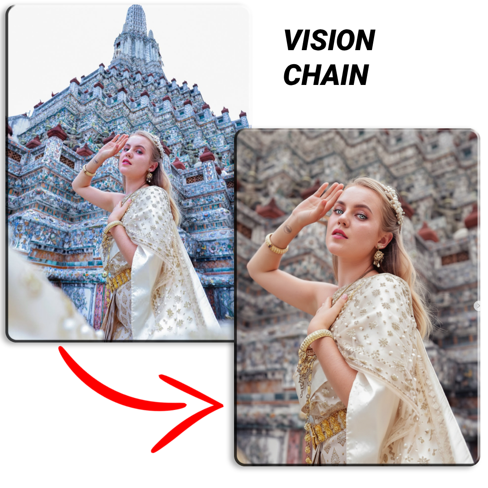
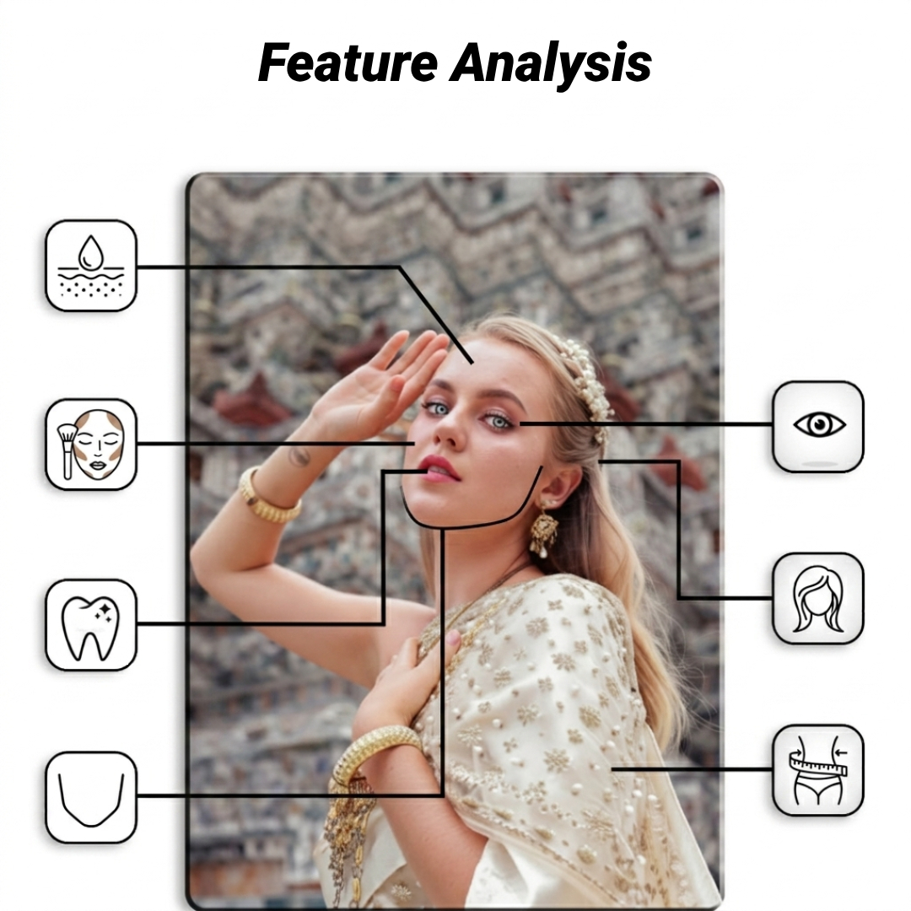

# Vision chain



## Overview

Python, FastAPI, Uvicorn, LangChain, LangGraph, Google Gen AI, React, TypeScript, Vite

Sandbox project built to experiment with multimodal AI pipelines and stateful orchestration.

The goal is to take a user-uploaded portrait, analyze it, and dynamically transform it using a graph-based agent workflow

### The Stack & Why
* **LangGraph & LangChain:** Handles the agent workflow, state management, and routing logic between execution nodes
* **Google Gen AI (`gemini-2.5-flash-image`):** Used both as a vision tool to analyze the image and as a generative engine for the final image-to-image modification.
* **LangSmith:** Hooked up for quick debugging, viewing execution traces, and tracking agent states in real-time.

### The Flow
1. **Analyze:** The system inspects the input image to detect visible features (skin, jawline, hair)
2. **Route:** It identifies the subject's gender to branch the state into a specific processing path
3. **Enhance:** It builds a tailored prompt based on the analysis and fires it at the Gemini vision model with customized safety overrides to generate a high-end, edited version of the portrait

## Features



### Graph Nodes & Agents Workflow

* **`image_cache`**: Uploads the image and creates a 5-minute Gemini Context Cache if the file exceeds 1024 tokens to save bandwidth and API costs
* **`gender_classification`**: A zero-temperature vision gatekeeper that detects if a human is present and returns their gender (`male`, `female`, or `none`) in raw JSON
* **`feature_analysis`**: Pydantic validation schemas dynamically based on gender to detect visible face/body parts (eyes, jawline, skin, hair)
* **`image_retouch_specifier`**: Conditional prompt builder. It maps the detected features into pro-grade retouching instructions
* **`execute_image_enhancement`**: The execution node. Fires the final prompt at `gemini-2.5-flash-image`, bypasses false-positive safety locks, and saves the output image

## State Management

The entire workflow relies on a single, stateful `AgentState` object managed by **LangGraph**. Each node in the graph reads from this shared context and returns only the fields it intends to update

```text
       [Input State]
             │
             ▼
      (image_cache)
             │
             ▼
  (gender_classification)
             │
             ▼
     (feature_analysis)
             │
             ▼
 (image_retouch_specifier)
             │
             ▼
(execute_image_enhancement)
             │
             ▼
      [Output State]
```

## Configuration

```
GOOGLE_API_KEY=
LANGCHAIN_TRACING_V2=true
LANGSMITH_ENDPOINT=https://eu.api.smith.langchain.com
LANGCHAIN_API_KEY=lsv2_pt_
LANGSMITH_PROJECT="vision-chain"
```

## Usage
```
cd backend && uvicorn main:app --reload --reload-dir .
cd frontend && npm run dev
```

## Project Structure
```text
vision-Chain/
├── backend/
│   ├── routers/
│   │   ├── agents/
│   │   │   ├── graph.py
│   │   │   ├── nodes.py
│   │   │   ├── router.py
│   │   │   ├── schemas.py
│   │   │   └── state.py
│   │   └── upload.py
│   └── main.py
├── frontend/
│   ├── src/
│   │   ├── App.tsx
│   │   ├── index.css
│   │   └── main.tsx
│   ├── index.html
│   ├── package.json
│   ├── tsconfig.json
│   └── vite.config.ts
├── static/
├── storage/
├── uploads/
├── .env
└── .gitignore
```

## License
This project is licensed under the MIT License - feel free to do whatever you want with the code